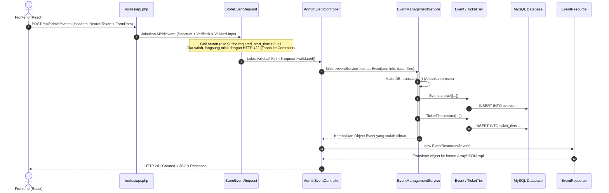

# Buku Panduan & Penjelasan Teknis Arsitektur GateMate
*Dokumen Khusus Persiapan Ujian / Presentasi Teknis Backend & Integrasi Frontend*

---

## 1. Konsep Dasar: Headless API & Separation of Concerns

GateMate dibangun menggunakan pola **Headless API (REST API)** dengan arsitektur **Service-Oriented Architecture (SOA)** di dalam framework Laravel. 

**Maksud dari Headless API:**
Backend (`Laravel`) tidak menghasilkan tampilan HTML/UI (seperti file `.blade.php`). Tugas backend **murni hanya memproses data dan membalas request dalam format JSON**. Sementara itu, seluruh antarmuka pengguna (UI/UX) diatur sepenuhnya oleh Frontend (`React`).

### Mengapa Memisahkan Controller dan Service Layer?
Dalam Laravel konvensional, sering kali developer menulis seluruh logika (validasi, query database, upload file, kalkulasi) langsung di dalam **Controller**. Ini disebut *Fat Controller*. Pada GateMate, kita menerapkan prinsip **Separation of Concerns (Pemisahan Tugas)**:

1. **Form Request (`app/Http/Requests/...`)**: Satpam validasi. Memastikan input dari user sudah benar dan sesuai format sebelum masuk ke Controller.
2. **Controller (`app/Http/Controllers/Api/...`)**: Penerima tamu (*HTTP Handler*). Tugasnya hanya menerima data yang sudah valid, memanggil Service, lalu membalas dengan status code HTTP (200, 201, 400, 422, dll.).
3. **Service Layer (`app/Services/...`)**: Otak utama (*Business Logic Layer*). Tempat seluruh kalkulasi, transaksi database, upload gambar, AI matchmaking, dan komunikasi eksternal (Midtrans) diproses.
4. **Model (`app/Models/...`)**: Representasi tabel database dan relasi antar-tabel menggunakan *Eloquent ORM*.
5. **API Resource (`app/Http/Resources/...`)**: Penata tampilan JSON (*Data Transformer*). Memastikan format JSON yang dikirim ke frontend selalu seragam dan aman (menyembunyikan data sensitif).

---

## 2. Bagaimana Backend Menyediakan & Mengamankan API (`routes/api.php` & Middleware)

Bagaimana tepatnya backend menyediakan (*expose*) endpoint agar bisa diakses oleh React Frontend? Seluruh pendaftaran dan pengaturan jalur API GateMate dipusatkan di dalam file **`routes/api.php`**. 

Secara default, Laravel otomatis menambahkan awalan (*URL prefix*) `/api` untuk semua rute di file ini. Contohnya, rute `/events` akan dapat diakses pada URL `http://localhost:8000/api/events`.

### A. Pengelompokan Rute & Pemetaan Method (`HTTP Methods`)
Backend memetakan setiap jenis aksi berdasarkan metode HTTP ke Controller yang sesuai:
* **`GET`**: Membaca/menarik data (contoh: mengambil daftar event).
* **`POST`**: Mengirim/membuat data baru (contoh: login, buat event baru).
* **`PUT / PATCH`**: Memperbarui data yang sudah ada.
* **`DELETE`**: Menghapus data.

Agar kode rapi dan terstruktur, rute dikelompokkan menggunakan **`Route::prefix`** dan **`Route::group`**:

```php
// 1. Rute Publik (Bisa diakses tanpa login)
Route::prefix('events')->name('api.events.')->group(function () {
    Route::get('/', [EventController::class, 'index'])->name('index'); // GET /api/events
    Route::get('/{id}', [EventController::class, 'show'])->name('show'); // GET /api/events/1
});
```

---

### B. Pengamanan & Pembatasan Akses (`Middleware`)
Untuk menjaga keamanan sistem dari akses ilegal maupun serangan siber, GateMate menerapkan 3 lapisan **Middleware** di dalam `routes/api.php`:

1. **Rate Limiting (`throttle:X,Y`) — Pencegah Serangan Brute Force & DDoS**
   Membatasi jumlah request dari IP yang sama dalam jangka waktu tertentu. Khusus untuk endpoint sensitif seperti Login dan OTP:
   ```php
   Route::prefix('auth')->name('api.auth.')->group(function () {
       // Maksimal 10 percobaan login per 1 menit per IP
       Route::post('/login', [AuthController::class, 'login'])
           ->middleware('throttle:10,1')
           ->name('login');

       // Pengiriman OTP maksimal 3 kali dalam 5 menit
       Route::post('/otp/send', [OtpController::class, 'send'])
           ->middleware('throttle:3,5');
   });
   ```

2. **Autentikasi Token (`auth:sanctum`)**
   Middleware ini memeriksa apakah request dari React membawa header **`Authorization: Bearer <token>`**. Jika token tidak ada, kedaluwarsa, atau palsu, Laravel langsung menolak request dengan status **`401 Unauthorized`** tanpa pernah memanggil Controller.
   ```php
   Route::middleware('auth:sanctum')->group(function () {
       Route::post('/auth/logout', [AuthController::class, 'logout']);
       Route::get('/auth/me', [AuthController::class, 'me']);
   });
   ```

3. **Verifikasi Peran / Role (`api.organizer.verified`, `api.user.role`, `api.superadmin`)**
   Setelah token dinyatakan sah, middleware khusus bertugas mengecek peran pengguna di database. Contohnya, pada rute pembuatan event di bawah ini, sistem memastikan **hanya pengguna dengan role Organizer DAN status KTP/akunnya sudah diverifikasi oleh Superadmin** yang diizinkan masuk:
   ```php
   Route::middleware(['auth:sanctum', 'api.organizer.verified'])
       ->prefix('admin')
       ->group(function () {
           // GET /api/admin/events
           Route::get('/events', [AdminEventController::class, 'index']);
           
           // POST /api/admin/events (Buat event baru)
           Route::post('/events', [AdminEventController::class, 'store']);
           
           // PUT /api/admin/events/{id} (Update event)
           Route::put('/events/{id}', [AdminEventController::class, 'update']);
           
           // DELETE /api/admin/events/{id} (Hapus event)
           Route::delete('/events/{id}', [AdminEventController::class, 'destroy']);
       });
   ```

---

## 3. Alur Kerja Request di Backend (Request Lifecycle)

Ketika Frontend mengirim request HTTP (contoh: `POST /api/admin/events`), berikut adalah urutan pasti bagaimana kode backend mengeksekusinya:



---

## 4. Hubungan Teknis: Dari Controller ke Service Layer (Code Deep-Dive)

Bagaimana tepatnya Controller bisa terhubung dengan Service? Jawabannya adalah **Dependency Injection (DI)** pada constructor PHP/Laravel.

### A. Tahap 1: Form Request (`StoreEventRequest.php`)
Sebelum kode di dalam method Controller dieksekusi, Laravel secara otomatis menjalankan Form Request terlebih dahulu.

```php
namespace App\Http\Requests\Admin;

use Illuminate\Foundation\Http\FormRequest;

class StoreEventRequest extends FormRequest
{
    // 1. Membersihkan/Menormalisasi data sebelum divalidasi
    protected function prepareForValidation(): void
    {
        if ($this->has('start_time') && strlen($this->start_time) > 5) {
            $this->merge(['start_time' => substr($this->start_time, 0, 5)]); // "14:30:00" -> "14:30"
        }
    }

    // 2. Aturan validasi ketat
    public function rules(): array
    {
        return [
            'title'            => ['required', 'string', 'max:255'],
            'category'         => ['required', 'string', 'max:100'],
            'start_date'       => ['required', 'date'],
            'start_time'       => ['required', 'date_format:H:i'],
            'banner_image'     => ['nullable', 'image', 'mimes:jpg,png,webp', 'max:4096'],
            'space_3d_file'    => ['nullable', 'file', 'mimes:mp4,webm,zip', 'max:51200'],
            'tier_name'        => ['required', 'string', 'max:100'],
            'price'            => ['required', 'numeric', 'min:0'],
        ];
    }
}
```
*Jika validasi gagal, Laravel langsung membalas ke React dengan `HTTP Status 422 Unprocessable Entity` beserta daftar errornya.*

---

### B. Tahap 2: Controller (`Admin\EventController.php`)
Controller menyuntikkan (*inject*) `EventManagementService` melalui `__construct()`. Dengan demikian, Controller tidak perlu tahu *bagaimana* event disimpan ke database; ia hanya memanggil method `createEvent()` milik Service.

```php
namespace App\Http\Controllers\Api\Admin;

use App\Http\Controllers\Controller;
use App\Http\Requests\Admin\StoreEventRequest;
use App\Http\Resources\EventResource;
use App\Services\EventManagementService;
use Illuminate\Http\JsonResponse;
use Illuminate\Support\Facades\Auth;

class EventController extends Controller
{
    // 1. Dependency Injection: Laravel otomatis menyediakan instance EventManagementService
    protected EventManagementService $eventService;

    public function __construct(EventManagementService $eventService)
    {
        $this->eventService = $eventService;
    }

    // 2. Method Store: Menerima request yang sudah lolos validasi (StoreEventRequest)
    public function store(StoreEventRequest $request): JsonResponse
    {
        // Pindahkan file gambar/video yang di-upload ke folder public/Media/uploads
        $bannerPath  = $this->uploadFile($request, 'banner_image', 'banner_');
        $posterPath  = $this->uploadFile($request, 'poster_image', 'poster_');
        $space3dPath = $this->uploadFile($request, 'space_3d_file', 'space3d_');

        // 3. Panggil Service Layer untuk menjalankan logika bisnis utama
        $event = $this->eventService->createEvent(
            Auth::id(), 
            $request->validated(), 
            $bannerPath, 
            $posterPath, 
            $space3dPath
        );

        // 4. Balas dengan HTTP 201 (Created) + JSON yang sudah dirapikan oleh EventResource
        return response()->json([
            'success' => true,
            'message' => 'Event berhasil dibuat!',
            'data'    => new EventResource($event),
        ], 201);
    }
}
```

---

### C. Tahap 3: Service Layer (`EventManagementService.php`)
Di sinilah logika database dieksekusi menggunakan **`DB::transaction()`**. Transaksi database menjamin sifat **Atomic (ACID)**: jika penyimpanan tier tiket (`TicketTier::create`) gagal karena suatu sebab, maka pembuatan `Event::create` yang sudah terjadi sebelumnya akan **dibatalkan secara otomatis (*rollback*)**. Ini mencegah terjadinya data cacat di database.

```php
namespace App\Services;

use App\Models\Event;
use App\Models\TicketTier;
use Illuminate\Support\Facades\DB;

class EventManagementService
{
    public function createEvent(int $adminId, array $validated, ?string $bannerPath, ?string $posterPath, ?string $space3dPath = null): Event
    {
        $bannerPath = $bannerPath ?? 'default-banner.jpg';

        // Pembungkus Transaksi Database
        return DB::transaction(function () use ($adminId, $validated, $bannerPath, $posterPath, $space3dPath) {
            
            // 1. Buat record di tabel `events`
            $event = Event::create([
                'id_admin'         => $adminId,
                'title'            => $validated['title'],
                'banner_image'     => $bannerPath,
                'poster_path'      => $posterPath,
                'space_3d_file'    => $space3dPath,
                'category'         => $validated['category'],
                'location_type'    => $validated['location_type'],
                'location_details' => $validated['location_details'],
                'start_date'       => $validated['start_date'],
                'start_time'       => $validated['start_time'],
                'end_date'         => $validated['end_date'],
                'end_time'         => $validated['end_time'],
                'capacity_type'    => $validated['capacity_type'],
                'status'           => 'active',
            ]);

            // 2. Tentukan apakah tiket tipe unlimited (stok 0) atau kuota terbatas
            $isUnlimited = filter_var($validated['is_unlimited'] ?? ($validated['capacity_type'] === 'unlimited'), FILTER_VALIDATE_BOOLEAN);
            $capacity    = $isUnlimited ? 0 : ($validated['quota'] ?? 0);

            // 3. Buat tier tiket perdana di tabel `ticket_tiers`
            TicketTier::create([
                'id_event'        => $event->id_event,
                'tier_name'       => $validated['tier_name'],
                'price'           => $validated['price'],
                'capacity'        => $capacity,
                'remaining_seats' => $capacity,
                'is_unlimited'    => $isUnlimited,
            ]);

            return $event; // Mengembalikan model event ke Controller
        });
    }
}
```

---

### D. Tahap 4: API Resource (`EventResource.php`)
API Resource mengubah *Eloquent Model* menjadi format JSON `snake_case` yang konsisten, serta mengubah nama file di database menjadi URL lengkap (*Absolute URL*).

```php
namespace App\Http\Resources;

use Illuminate\Http\Resources\Json\JsonResource;

class EventResource extends JsonResource
{
    public function toArray($request): array
    {
        return [
            'id'               => $this->id_event,
            'title'            => $this->title,
            'category'         => $this->category,
            'status'           => $this->status,
            'start_date'       => $this->start_date?->toDateString(),
            'start_time'       => $this->start_time,
            'banner_image_url' => $this->banner_image ? asset('Media/uploads/' . $this->banner_image) : null,
            'space_3d_file_url'=> $this->space_3d_file ? asset('Media/uploads/' . $this->space_3d_file) : null,
            'created_at'       => $this->created_at?->toIso8601String(),
        ];
    }
}
```

---

## 5. Bagaimana Frontend Menarik dan Mengirim Data? (REST API & Token Auth)

### Apa itu REST API?
Frontend (React) dan Backend (Laravel) adalah dua aplikasi terpisah yang berkomunikasi melalui protokol HTTP.
* **HTTP Methods:**
  * `GET`: Menarik/mengambil data (contoh: mengambil daftar event).
  * `POST`: Mengirim/membuat data baru (contoh: membuat event baru, login).
  * `PUT / PATCH`: Memperbarui data yang sudah ada.
  * `DELETE`: Menghapus data.

### Sistem Autentikasi (`Bearer Token / JWT`)
Karena HTTP bersifat *Stateless* (server tidak mengingat siapa yang baru saja request), GateMate menggunakan **Laravel Sanctum Token**.
1. Saat user **Login (`POST /api/auth/login`)**, backend memvalidasi email/password dan menghasilkan **Token String** (misal: `1|abcde12345...`).
2. React menyimpan token tersebut ke `localStorage`.
3. Setiap kali React ingin mengakses endpoint yang diproteksi middleware `auth:sanctum` (seperti membuat event), React **wajib menyisipkan token tersebut di HTTP Header**:
   ```http
   Authorization: Bearer 1|abcde12345...
   ```

---

### Kode Nyata Integrasi di Frontend GateMate (`Axios & FormData`)

#### A. Pengaturan Interceptor Global (`src/lib/api.js`)
Frontend menggunakan library **Axios** yang sudah dikonfigurasi (*Interceptor*) agar otomatis menempelkan `Bearer Token` di setiap request ke backend:

```javascript
import axios from 'axios';

const api = axios.create({
  baseURL: 'http://localhost:8000/api', // Alamat server Laravel API
});

// Interceptor: Menempelkan token dari localStorage sebelum request dikirim
api.interceptors.request.use((config) => {
  const authData = JSON.parse(localStorage.getItem('auth-storage') || '{}');
  const token = authData?.state?.token;
  
  if (token) {
    config.headers.Authorization = `Bearer ${token}`;
  }
  return config;
});

export default api;
```

#### B. Menarik Data (`GET /api/events`)
Saat user membuka halaman utama, React menarik data event:

```javascript
// Di dalam halaman Events.jsx / AdminEventShowPage.jsx
const fetchEventDetail = async () => {
  try {
    // Mengirim HTTP GET ke http://localhost:8000/api/admin/events/1
    const response = await api.get(`/admin/events/${id}`);
    
    // Hasil JSON dari EventResource tersimpan di response.data.data
    console.log("Judul Event:", response.data.data.event.title);
  } catch (error) {
    console.error("Gagal menarik data:", error);
  }
};
```

#### C. Mengirim Data beserta File Gambar (`POST /api/admin/events`)
Mengirim teks biasa menggunakan format `application/json`. Namun, karena pembuatan event melibatkan **upload file (poster & video 3D)**, frontend wajib menggunakan objek browser **`FormData`** dengan header `multipart/form-data`:

```javascript
// Di dalam AdminEventCreatePage.jsx (handleSubmit)
const handleSubmit = async (e) => {
  e.preventDefault();

  // 1. Buat object FormData (penampung teks & file biner)
  const payload = new FormData();
  payload.append('title', formData.title);
  payload.append('category', formData.category);
  payload.append('start_date', formData.start_date);
  payload.append('start_time', formData.start_time);
  
  // 2. Lampirkan file biner jika ada
  if (bannerFile) {
    payload.append('banner_image', bannerFile); // File object dari <input type="file" />
  }
  if (space3dFile) {
    payload.append('space_3d_file', space3dFile);
  }

  try {
    // 3. Kirim ke backend menggunakan POST multipart/form-data
    const res = await api.post('/admin/events', payload, {
      headers: { 'Content-Type': 'multipart/form-data' }
    });

    alert("Sukses: " + res.data.message);
  } catch (err) {
    // Menangkap pesan error validasi HTTP 422 dari StoreEventRequest
    const pesanError = Object.values(err.response.data.errors)[0][0];
    alert("Error: " + pesanError);
  }
};
```

---

## 6. Pertanyaan Kunci & Jawaban Siap Pakai untuk Ujian

### Q1: Mengapa menggunakan arsitektur Headless API + React SPA, bukan langsung Blade?
> **Jawaban:** "Untuk memisahkan beban kerja (*Decoupling*). Backend fokus 100% pada keamanan, performa database, dan logika bisnis, sedangkan Frontend fokus pada interaktivitas antarmuka (*User Experience*). Selain itu, dengan Headless API (`routes/api.php`), backend kita siap digunakan untuk berbagai klien sekaligus: baik Web React saat ini, maupun jika nantinya kita membuat aplikasi Mobile Android/iOS tanpa perlu merombak ulang kode backend."

### Q2: Bagaimana cara backend menyediakan dan mengamankan API yang diakses Frontend?
> **Jawaban:** "Seluruh endpoint dipusatkan pada file `routes/api.php` dengan awalan URL `/api`. Untuk pengamanannya, kami menerapkan 3 lapis Middleware: pertama **`throttle:X,Y`** untuk membatasi laju request agar kebal serangan Brute Force/DDoS; kedua **`auth:sanctum`** untuk memvalidasi sah/tidaknya Bearer Token JWT; dan ketiga **Role & Verification Check (`api.organizer.verified` atau `api.superadmin`)** untuk memastikan hanya pengguna dengan peran yang tepat dan sudah terverifikasi KTP/Admin yang diizinkan mengakses fitur sensitif."

### Q3: Apa keuntungan utama memisahkan Controller dan Service Layer?
> **Jawaban:** "Menjaga prinsip **Single Responsibility Principle (SRP)** dan kemudahan pemeliharaan (*Maintainability*). Jika kode pembuatan event atau pemotongan saldo e-wallet ditaruh di Controller, maka saat kita butuh memanggil logika yang sama dari fitur lain (misal dari *Cron Job* otomatis atau *Command Line Artisan*), kita harus menduplikasi kode. Dengan menaruhnya di `Service`, Controller kita tetap ringkas (*Slim*) dan logika bisnis bisa dipanggil dari mana saja (*Reusable*)."

### Q4: Bagaimana cara sistem mencegah data cacat/rusak jika error terjadi di tengah proses penyimpanan ke database?
> **Jawaban:** "Kami menggunakan **Database Transaction (`DB::transaction()`)** pada Service Layer. Misalnya saat membuat event, sistem harus menyimpan ke tabel `events` DAN tabel `ticket_tiers`. Jika saat menyimpan tabel `ticket_tiers` terjadi error (misalnya koneksi putus atau tipe data salah), maka perintah SQL `Event::create` yang sudah sempat dieksekusi sebelumnya akan dibatalkan secara otomatis (`rollback`), sehingga tidak menyisakan data event yang tanpa tiket di dalam database."

### Q5: Apa fungsi `Form Request` (`StoreEventRequest`) dan kenapa tidak divalidasi saja di Controller?
> **Jawaban:** "`Form Request` berfungsi sebagai gerbang keamanan awal sebelum kode di dalam Controller dieksekusi. Jika kita menaruh `$request->validate()` di Controller, method Controller akan menjadi sangat panjang dan kotor. Dengan Form Request, kita juga dapat memanfaatkan method `prepareForValidation()` untuk menormalisasi input terlebih dahulu—sebagai contoh, memotong format jam `14:30:00` dari browser menjadi `14:30` agar sesuai dengan format validasi database."

### Q6: Bagaimana mekanisme komunikasi antara Frontend React dan Backend Laravel?
> **Jawaban:** "Komunikasi dilakukan secara asinkron menggunakan library HTTP **Axios** via format REST API. Setiap kali user berhasil login, Laravel menerbitkan **Sanctum Bearer Token** yang kemudian disimpan oleh React di `localStorage`. Saat React meminta atau mengirim data ke endpoint yang terproteksi, Axios Interceptor secara otomatis menempelkan header `Authorization: Bearer <token>`. Untuk pengiriman data bergambar/file seperti saat membuat event, React membungkus data dalam objek `FormData` dengan tipe konten `multipart/form-data`."
